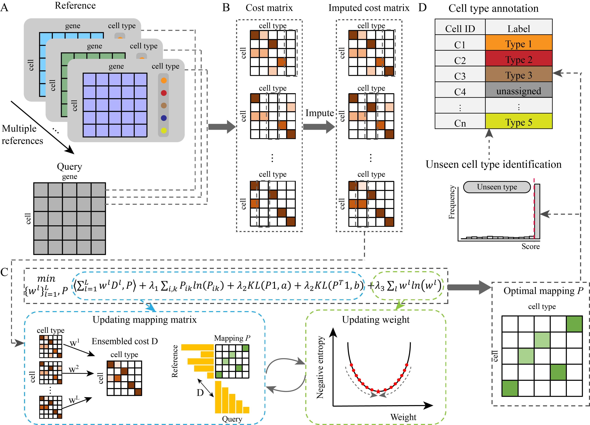

# scDOT: Enhancing single-cell RNA-Seq data annotation and uncovering novel cell types through multi-reference integration

scDOT is designed for annotating newly sequenced (query) data with the assistance of multiple well-annotated scRNA-seq datasets. For query cells belonging to cell types present in the references, scDOT assigns them corresponding cell types, whereas query cells not associated with reference cell types are annotated as ``unseen types''. scDOT harnesses an optimal transport model to learn a probabilistic map linking unannotated query cells with cell types in the reference data, facilitating query cell annotation and unseen cell type identification.

## System Requirements

Python support packages: pandas, numpy, scanpy, scipy, POT

## Versions the software has been tested on

- System: Ubuntu 18.04.5
- Python: 3.8.8
- Python packages: pandas = 1.2.3, numpy = 1.23,5, scanpy=1.8.2, scipy = 1.4.1, POT = 0.9.1

# Useage
The mtANN repository includes the scDOT code files in the `scDOT ` folder and provides a usage example `example` which specifically shows the format of the input data and the usage of the main function. The data used in the example are in the `datasets ` folder. 

The annotation result can be obtained by running the main function:
`scDOT(loc, ref_name, query_name)`, and the input variables are:

`loc`: Where reference data and query data are stored.
`ref_name`: A list of names of the reference datasets.
`query_name`: The name of the query datasets.

The input data considered by the current version of mtANN is in `csv` format, where rows are samples and columns are features. In addition, its cell type information is stored in another csv file, and its naming format is the name of the dataset + `_label`.

 
# Contact

Please do not hesitate to contact Miss Yi-Xuan Xiong ([xyxuana@mails.ccnu.edu.cn](xyxuana@mails.ccnu.edu.cn)) or Dr. Xiao-Fei Zhang ([zhangxf@ccnu.edu.cn](zhangxf@ccnu.edu.cn)) to seek any clarifications regarding any contents or operation of the archive.

